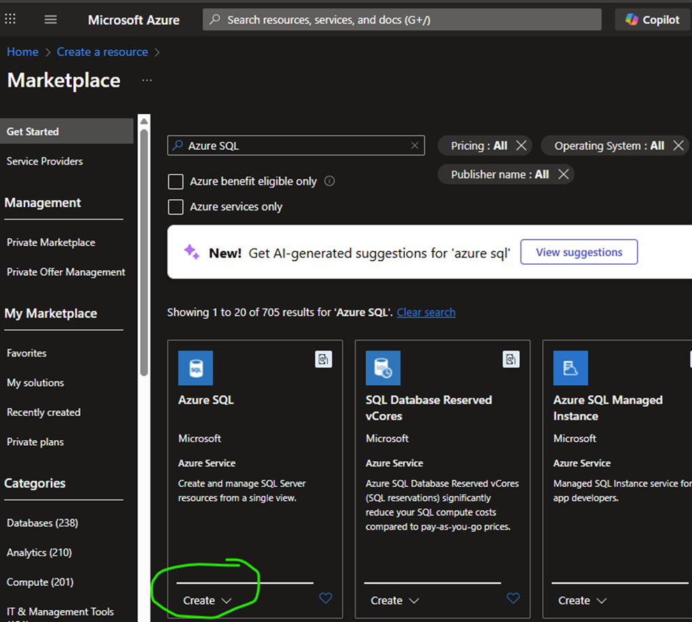
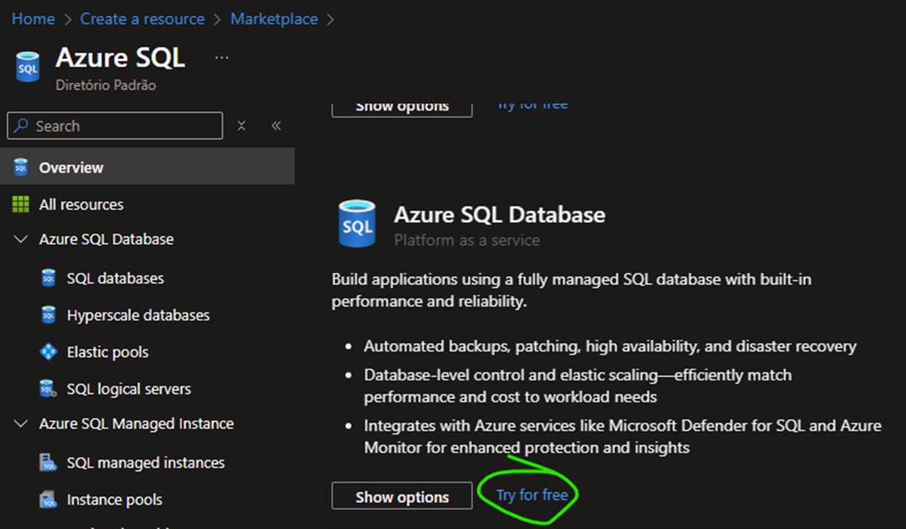
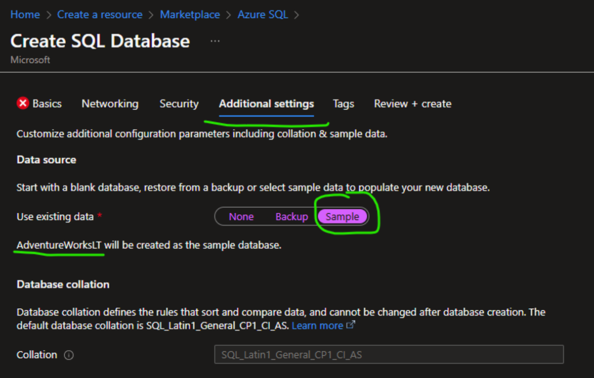
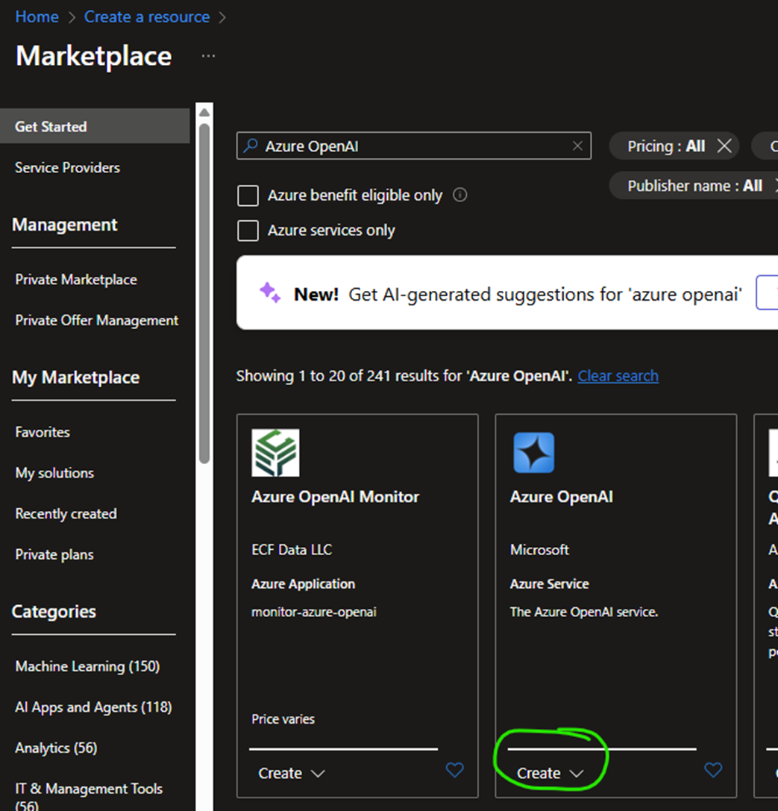
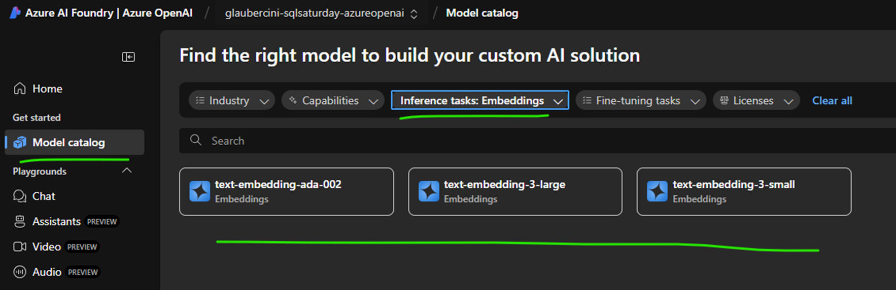

# How to create an Azure SQL Database:

#### Step 1


#### Step 2


#### Step 3

or you can run the script [AdventureWorksLT2025.sql](AdventureWorksLT2025.sql)


# How to create an Azure AI Model

##### Step 1


##### Step 2



# How to setup Azure SQL Database
#### Step 1
Run the model creation script:
```SQL
CREATE MASTER KEY ENCRYPTION BY PASSWORD = 'MY_MASTER_KEY_PASSWORD';
OPEN MASTER KEY DECRYPTION BY PASSWORD = 'MY_MASTER_KEY_PASSWORD';

CREATE DATABASE SCOPED CREDENTIAL [https://my_model_name.openai.azure.com/]
	WITH IDENTITY = 'HTTPEndpointHeaders', secret = '{"api-key":"MY_API_KEY"}';
GO

CREATE EXTERNAL MODEL MyAzureOpenAiModel
WITH (
	LOCATION = 'https://my_model_name.openai.azure.com/openai/deployments/text-embedding-ada-002/embeddings?api-version=2023-05-15',
	API_FORMAT = 'Azure OpenAI',
	MODEL_TYPE = EMBEDDINGS,
	MODEL = 'text-embedding-ada-002',
	CREDENTIAL = [https://my_model_name.openai.azure.com/]
);
```

If using SQL Server 2025 you may need to enable external rest calls
```SQL
EXECUTE sp_configure 'external rest endpoint enabled', 1;
GO

RECONFIGURE WITH OVERRIDE;
GO
```

In order to store the embeddings and the text chunk used to create it run:
```SQL
ALTER TABLE [SalesLT].[Product]
	ADD embeddings VECTOR (1536),
		chunk NVARCHAR (2000);
```

Now, it is possible to populate embeddings and chunks running this script:
```SQL
SET NOCOUNT ON;

DROP TABLE IF EXISTS #MYTEMP;

DECLARE @ProductID int
DECLARE @text NVARCHAR (MAX);

SELECT * INTO #MYTEMP FROM [SalesLT].Product WHERE embeddings IS NULL;

SELECT @ProductID = ProductID FROM #MYTEMP;

SELECT TOP(1) @ProductID = ProductID FROM #MYTEMP;

WHILE @@ROWCOUNT <> 0
BEGIN
	SET @text = (
		SELECT p.Name + ' ' + ISNULL(p.Color, 'No Color') + ' ' + c.Name + ' ' + m.Name + ' ' + ISNULL(d.Description, '')
		FROM [SalesLT].[ProductCategory] c,
			 [SalesLT].[ProductModel] m,
			 [SalesLT].[Product] p
		LEFT OUTER JOIN [SalesLT].[vProductAndDescription] d
			 ON p.ProductID = d.ProductID
			 AND d.Culture = 'en'
		WHERE p.ProductCategoryID = c.ProductCategoryID
		AND p.ProductModelID = m.ProductModelID
		AND p.ProductID = @ProductID
	);
	UPDATE [SalesLT].[Product] SET [embeddings] = AI_GENERATE_EMBEDDINGS(@text USE MODEL MyAzureOpenAiModel), [chunk] = @text WHERE ProductID = @ProductID;

	DELETE FROM #MYTEMP WHERE ProductID = @ProductID;

	SELECT TOP(1) @ProductID = ProductID FROM #MYTEMP;
END
```

And it is possible to test the new AI embeddings search using:
```SQL
declare @search_text nvarchar(max) = 'I am looking for a red bike and I dont want to spend a lot'
declare @search_vector vector(1536) = AI_GENERATE_EMBEDDINGS(@search_text USE MODEL MyAzureOpenAiModel);
SELECT TOP(4) p.ProductID, p.Name , p.chunk,
VECTOR_DISTANCE('cosine', @search_vector, p.embeddings) AS distance
FROM [SalesLT].[Product] p
ORDER BY distance;
```